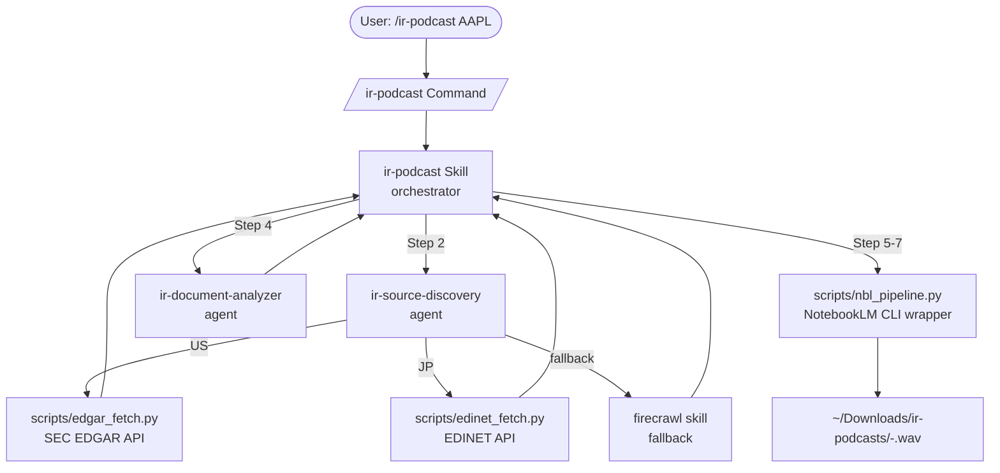

# Architecture

ir-podcast-plugin の設計図と各 component の役割分担。

## High-level Flow



## Component 役割分担

### Layer 1: Entry Point (Commands)

| Command | 責務 |
|---|---|
| `/ir-podcast <ticker>` | 単発 ticker → audio podcast |
| `/ir-podcast-batch <tickers>` | 並列複数社 → 並列 audio |
| `/ir-research <ticker>` | text summary のみ (audio skip) |

各 command は SKILL.md に処理を委譲する thin entry point。

### Layer 2: Skills (Orchestrators)

| Skill | 責務 | Steps |
|---|---|---|
| `ir-podcast` | end-to-end pipeline | 1-8 (resolve → discover → fetch → analyze → upload → audio → download → notify) |
| `ir-research` | text-only pipeline | 1-4 (Step 5 以降 skip) |

Orchestrator は subagent と script を順次呼ぶだけのシンプル責務。判断ロジックは agent / script に押し込み、SKILL.md は flow 制御に集中。

### Layer 3: Agents (Specialists)

| Agent | 責務 | Tools |
|---|---|---|
| `ir-source-discovery` | US/JP routing + IR doc URL 特定 | Bash, WebFetch, Read, Write |
| `ir-document-analyzer` | PDF/HTML 整形 + 構造化サマリ生成 | Read, Bash, Write |

Agent は **長文の reasoning** を担当 (URL 候補の絞り込み、章立て抽出、重複判定)。Token-heavy な作業を main context から切り離す。

### Layer 4: Scripts (Tools)

| Script | 責務 | 外部 |
|---|---|---|
| `edgar_fetch.py` | SEC EDGAR API client | https://data.sec.gov |
| `edinet_fetch.py` | EDINET API client | https://api.edinet-fsa.go.jp |
| `nbl_pipeline.py` | notebooklm CLI wrapper | `notebooklm` (pip) |

Script は **deterministic な I/O** を担当 (HTTP request, file download, subprocess invocation)。LLM reasoning なし、純粋な実装。

### Layer 5: External Dependencies

| 依存 | 関係 | License |
|---|---|---|
| `notebooklm-py` | pip dependency | MIT (上流) |
| `firecrawl` skill | optional, fallback | (Skill 自体は user 環境) |
| `defuddle` skill | optional, HTML cleanup | (同上) |
| SEC EDGAR API | public, no auth | US Gov public |
| EDINET API | public, free key | 利用申請後 free |

## データフロー詳細

### 入力 → 出力

```
入力: ticker (e.g., "AAPL")
   ↓
[Step 1: Resolve] → CIK ("0000320193") or 証券コード
   ↓
[Step 2: Discover] → manifest JSON (10-K URL, 10-Q URL, ...)
   ↓
[Step 3: Fetch] → ./downloads/AAPL/2025-09-28-10-K.pdf
   ↓
[Step 4: Analyze] → ./downloads/AAPL/2025-09-28-10-K-cleaned.md + summary.md
   ↓
[Step 5: Upload] → NotebookLM notebook ID
   ↓
[Step 6: Generate] → notebook 内に audio artifact
   ↓
[Step 7: Download] → ~/Downloads/ir-podcasts/AAPL-20250928.wav
   ↓
[Step 8: Notify] → terminal-notifier
出力: .wav file + 通知
```

## Caching Strategy

| Layer | Cache key | Cache 場所 | Invalidation |
|---|---|---|---|
| Step 3 (Fetch) | `<ticker>/<date>-<type>` | `./downloads/<ticker>/` | `--no-cache` flag |
| Step 4 (Analyze) | source file hash | `./downloads/<ticker>/*-cleaned.md` | source 変更時に再生成 |
| Step 5-7 (NotebookLM) | notebook title (= `<ticker> IR <date>`) | NotebookLM 側 | 同 title が既存 → skip option (TODO) |

## Error Handling

| Step | 失敗パターン | 動作 |
|---|---|---|
| Step 1 | 不明 ticker | exit 1 + suggest |
| Step 2 | API 全滅 | manifest 空 + Firecrawl fallback |
| Step 3 | rate limit / 5xx | exponential backoff x3 |
| Step 4 | PDF parse fail | skip & warn (他 doc は続行) |
| Step 5 | source 上限超過 | 章単位分割 → 再 upload |
| Step 6 | audio gen timeout | 1 回 retry → fail |
| Step 7 | download error | 再 download attempt |

batch 実行時は **1 ticker 失敗 → 他 ticker 続行**、最後にまとめて failed list を表示。

## なぜこの分割か

- **Skill / Agent / Script の 3 層**: agentskills BP の Progressive Disclosure に準拠
- **Skill = orchestration / Agent = reasoning / Script = I/O** の責務分離で test しやすい
- **NotebookLM 依存を script に閉じ込めた**: cookie auth が壊れても他 layer は影響受けない
- **EDGAR / EDINET を別 script**: それぞれ独立に test 可能、片方だけ install/disable 可

## 拡張ポイント

将来追加可能 (現 v0.1.0 では out of scope):

- TDnet (適時開示) 取得 — 別 script `tdnet_fetch.py` 追加
- 韓国 (DART) / 香港 (HKEX) 対応 — 別 script + agent routing 拡張
- 差分検出 (前回 podcast との内容比較) — `scripts/diff_check.py` 追加
- Slack / Discord 通知 — Step 8 に branch 追加
- 字幕付き video 生成 — NotebookLM video artifact + ffmpeg
